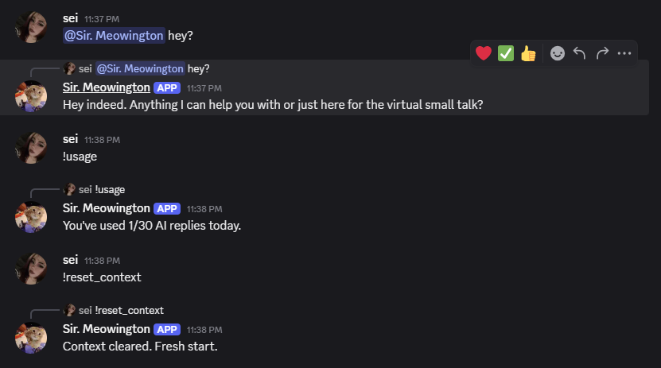
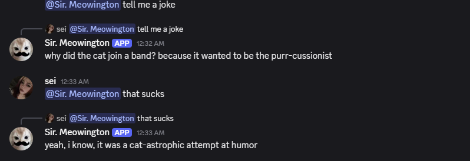

# Discord AI Chat Bot

AI chatbot for Discord powered by Groq's free-tier API.




## Setup

1. Install dependencies:
   ```
   pip install -r requirements.txt --break-system-packages
   ```

2. Copy `.env.example` to `.env` and fill in your tokens:
   ```
   cp .env.example .env
   ```
   - `DISCORD_TOKEN`: from https://discord.com/developers/applications (create an app, add a bot, enable "Message Content Intent" under Bot settings)
   - `GROQ_API_KEY`: from https://console.groq.com (free signup)

3. Invite the bot to your server using the OAuth2 URL generator in the Discord Developer Portal (scopes: `bot`; permissions: Send Messages, Read Message History).

4. Run it:
   ```
   python bot.py
   ```

## Usage

- @mention the bot to chat with it
- `!usage` — check your daily AI reply count
- `!reset_context` — clear the bot's memory of the current channel

## Notes

- Daily limit is 30 AI replies per user (edit `DAILY_LIMIT` in bot.py to change)
- Conversation context is kept in memory (last 8 messages per channel) and resets on bot restart
- Usage counts persist in `usage.db` (SQLite)
